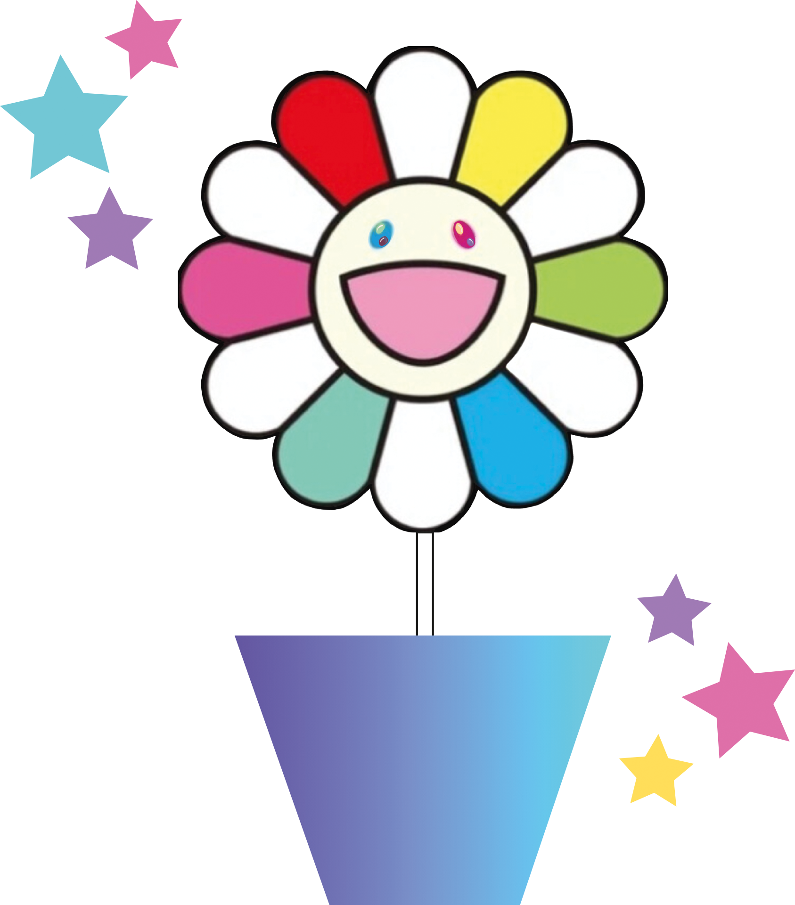

# Flowers Game  

  

Inspiré par l'artiste contemporain Takashi Murakami, ce jeu de dés interactif pour deux joueurs allie créativité, couleurs vives et divertissement. Développé en utilisant les technologies HTML, CSS, Bootstrap et JavaScript /ES6, le jeu offre une expérience utilisateur ludique, adaptée à tous les navigateurs et entièrement responsive. 

Le concept :
Les éléments visuels et la charte graphique ont été soigneusement modifiés pour se démarquer des projets similaires et refléter une sensibilité artistique originale.
Pour enrichir l'expérience utilisateur, j'ai ajouté des effets sonores lors des clics sur les différents boutons et lorsqu'un joueur a remporté la partie.

Fonctionnalités :
Le jeu propose une expérience de jeu fluide et engageante pour deux joueurs. Le déroulement du jeu est simple et intuitif, avec des règles faciles à comprendre et des mécaniques de jeu stimulantes. Les règles du jeu sont accessibles , sous le bouton "nouvelle partie".

Conclusion :
Ce jeu de dés interactif est un exemple de la manière dont l'art contemporain et la technologie peuvent se combiner pour créer des expériences ludiques et visuellement captivantes.

Jeu vidéo réalisé avec les versions:
- HTML 5
- CSS 3
- BOOSTRAP 5.2
- JAVASCRIPT / ESC6

Serveur: Netlify
Projet en ligne 
https://clever-lamington-5b3c8d.netlify.app/
